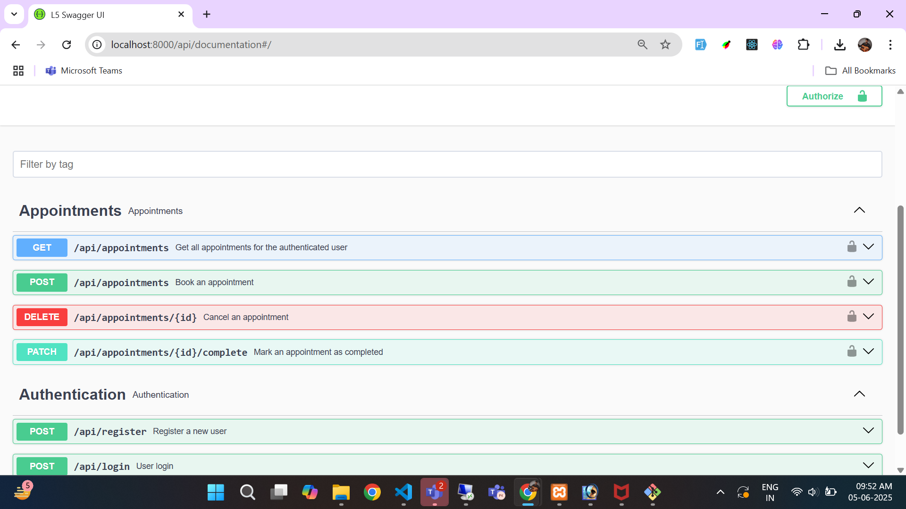
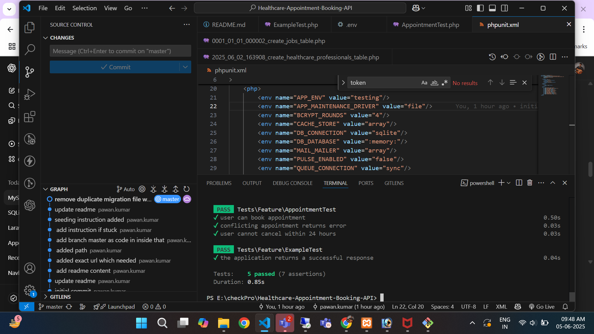

# 🏥 Laravel 12 Healthcare Appointment Booking API

A fully-featured RESTful API for a Healthcare Appointment Booking System built with Laravel 12.  
Includes user authentication via Sanctum, 
appointment booking and cancellation logic,
conflict detection, 
and Swagger API documentation.

---

## 🚀 Features

- User registration, login, and logout using Laravel Sanctum  
- Book, cancel, or complete healthcare appointments  
- Prevent appointment cancellation within 24 hours of the scheduled time  
- Conflict detection to avoid double booking  
- Swagger (OpenAPI) documentation for easy API exploration  
- Feature testing with PHPUnit  

---

## 🛠️ Setup Instructions

### 1. Clone the Repository

```bash
git clone https://github.com/kumarpawan9709/Healthcare-Appointment-Booking-API.git
cd Healthcare-Appointment-Booking-API
git checkout master

```

### 2. Install Dependencies

```bash
composer install
```
### Note: If Stuck at “Generating optimized autoload files” (it may take sfew minutes)

```bash
composer install --no-scripts --no-autoloader
composer dump-autoload -o
```

### 3. Setup Environment

Copy the example environment file and configure your database:

```bash
cp .env.example .env
```

Edit `.env` and update your database credentials:

```
DB_CONNECTION=mysql
DB_HOST=127.0.0.1
DB_PORT=3306
DB_DATABASE=your_database_name
DB_USERNAME=your_database_user
DB_PASSWORD=your_database_password
```

### 4. Generate Application Key & Run Migrations

```bash
php artisan key:generate
php artisan migrate
```
### 5. If want to seed testing data run below command to generate some testing data

```bash
php artisan db:seed
```
 
### 6. Generate Swagger Documentation

```bash
php artisan l5-swagger:generate
```

### 7. Start the Development Server

```bash
php artisan serve
```

---

## 📖 API Documentation

Access the Swagger UI to explore the API endpoints:

```
http://localhost:8000/api/documentation
```


### How to use Authentication via Swagger UI

1. Go to the **Authentication** section in the Swagger UI.  
2. Use the `POST /api/register` endpoint to create a new user.  
3. Use the same credentials to log in via `POST /api/login`.  
4. Copy the `access_token` from the login response, which looks like:

```json
{
  "access_token": "8|4nsWq7trMbicDYrow2GF8np9Jvm5Wc2leja7WyuN0fd91ca7",
  "token_type": "Bearer"
}
```

5. Click the **Authorize** button on the top right of Swagger UI.  
6. Paste the token in the format `Bearer YOUR_ACCESS_TOKEN` and authorize.  
7. Now you can access all protected API endpoints directly through Swagger UI.

---

## 🧪 Testing

Run feature tests with PHPUnit:

```bash
php artisan test
```


 
